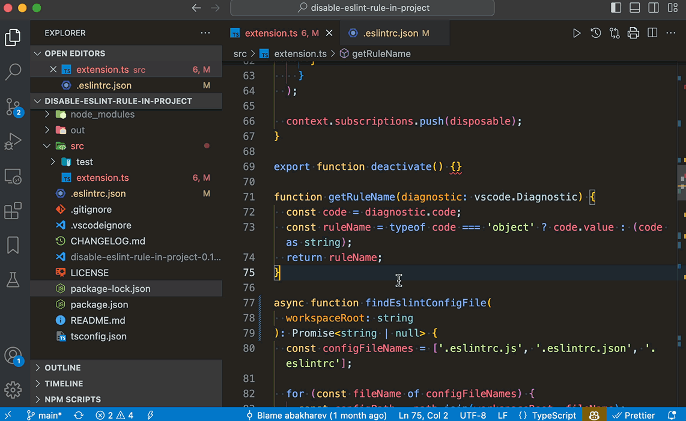

# Disable ESLint Rule in Project

https://marketplace.visualstudio.com/items?itemName=artembakharev.disable-eslint-rule-in-project

This Visual Studio Code extension allows you to quickly disable an ESLint rule directly from the editor. The code for this extension was generated by Chat GPT 4.

## Features

- Adds a "Disable rule {rule-name} in project" option to the Quick Fix menu for ESLint errors.
- Automatically updates the ESLint configuration file in your project to disable the selected rule.

## Requirements

This extension works in conjunction with the [ESLint extension](https://marketplace.visualstudio.com/items?itemName=dbaeumer.vscode-eslint) for Visual Studio Code. Ensure that you have the ESLint extension installed and properly configured in your project.

## Usage

1. Open a JavaScript file with ESLint errors.
2. Hover over the error and click on the lightbulb icon that appears (or press `cmd+.` or `ctrl+.`).
3. Select the "Disable rule {rule-name} in project" option from the Quick Fix menu.
4. The extension will update your ESLint configuration file, disabling the selected rule for the entire project.

## Known Limitations

- This extension currently supports only `.eslintrc.json`, `.eslintrc.js` and `package.json` ESLint configuration file formats. Other formats, like `.yml` and `.yaml`, are not supported.

## Contributing

If you have any suggestions, bug reports, or feature requests, feel free to [create an issue](https://github.com/mrThomasTeller/vscode-disable-eslint-rule-in-project/issues) or submit a pull request.

## License

This extension is released under the [MIT License](https://opensource.org/licenses/MIT).
